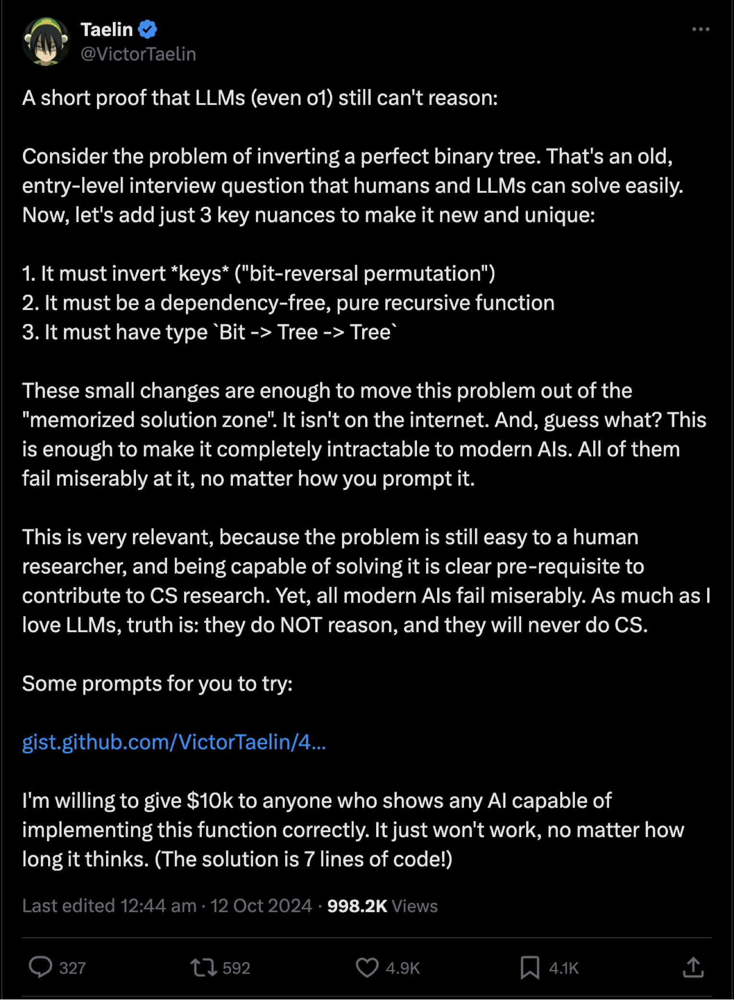

# Victor Taelin's Bit-Reversal Trees Challenge: Haskell Solutions and Python LLM Search

<p align="center">
  <a href="https://www.haskell.org/ghcup/"></a>&nbsp;
  <a href="https://www.python.org/downloads/"></a>&nbsp;
  <a href="https://platform.openai.com/docs/api-reference"></a>&nbsp;
  <a href="https://docs.anthropic.com/en/api/getting-started"></a>&nbsp;
  <a href="https://wandb.ai/site"></a>&nbsp;
  <a href="https://x.com/VictorTaelin/status/1844886809005687270"></a>
</p>

This project implements and tests solutions to the bit-reversal permutation on binary trees, as proposed in [Victor Taelin's challenge](https://x.com/VictorTaelin/status/1844886809005687270). It includes Haskell implementations and a Python-based Large Language Model (LLM) search for valid Haskell solutions.

## The Challenge

Victor's challenge involves coming up with a prompt to show that a LLM is capable of implementing a solution to the problem of inverting a binary tree with specific requirements:
1. It must invert the keys using a "bit-reversal permutation"
2. It must be a dependency-free, pure recursive function
3. The function may use one extra bit of state if needed, i.e. it must have the type signature `Tree -> Tree` or `Bool -> Tree -> Tree` (direct recursion with maximum 1 bit of state)

<p align="center">
  <a href="https://x.com/VictorTaelin/status/1844886809005687270">
    
  </a>
</p>

### Initial Prompt

My Haskell prompt, adapted from [Victor's prompt](https://gist.github.com/VictorTaelin/45440a737e47b872d7505c6cda27b6aa) and kept under 1k tokens, is in [`haskell_prompt.md`](haskell_prompt.md). The Python prompt is in [`python_prompt.md`](python_prompt.md).
Note that there are two versions of the prompt, for each language: one that allows the use of a helper function using one extra bit of state, and one that does not mention any such helper function ([`haskell_prompt_no_helper.md`](haskell_prompt_no_helper.md) and [`python_prompt_no_helper.md`](python_prompt_no_helper.md)).

> [!NOTE]
> For full details about the challenge, see: 
> - [Victor's tweet](https://x.com/VictorTaelin/status/1844886809005687270)
> - [Victor's gist](https://gist.github.com/VictorTaelin/45440a737e47b872d7505c6cda27b6aa)

## Project Structure

```
.
├── .env.example
├── README.md
├── Victor_challenge.md
├── haskell_prompt.md
├── python
│   ├── requirements.txt
│   ├── solutions0.txt
│   ├── solve_challenge.py
│   ├── test_solve_challenge.py
│   └── utils.py
├── Setup.hs
├── package.yaml
├── stack.yaml
├── app
│   └── Main.hs
├── src
│   └── Lib.hs
└── test
    ├── DynamicSpec.hs
    └── Spec.hs
```

where:

- [`src/Lib.hs`](src/Lib.hs): Contains Haskell implementations of the bit-reversal tree inversion (see [`haskell_prompt.md`](haskell_prompt.md) for the prompt used to generate the AI ones)
- [`test/Spec.hs`](test/Spec.hs): QuickCheck tests for the Haskell implementations in `src/Lib.hs`
- [`test/DynamicSpec.hs`](test/DynamicSpec.hs): QuickCheck tests for the Haskell implementations generated during the LLM search
- [`python/solve_challenge.py`](python/solve_challenge.py): Python script to search for valid Haskell solutions using LLMs
- [`python/utils.py`](python/utils.py): Utility functions for the Python LLM search
- [`python/test_solve_challenge.py`](python/test_solve_challenge.py): Pytest file for testing the Python-GHCi integration for the LLM search
- [`python/test_custom_invert.py`](python/test_custom_invert.py): Pytest file for testing custom Python implementations of the `invert` function
- [`python/hypothesis_tests_python.py`](python/hypothesis_tests_python.py): Hypothesis tests for the Python implementations
- [`python/test_solve_challenge_hypothesis.py`](python/test_solve_challenge_hypothesis.py), [`python/test_solve_challenge_quickcheck.py`](python/test_solve_challenge_quickcheck.py): Hypothesis and QuickCheck tests (to be run with `python -m pytest`) to make sure the LLM search is working as expected in [solve_challenge.py](python/solve_challenge.py).

## Getting Started

### Prerequisites

1. Haskell with Stack (if you want to search over Haskell programs)
2. Python 3.7+
3. OpenAI API key (for GPT models)
4. Anthropic API key (for Claude models)
5. Weights & Biases API key (optional, for LLM logging)

### Step-by-Step Guide

#### Haskell Setup

1. Clone the repository:
   ```sh
   git clone https://github.com/youqad/bit-reversal-trees.git
   cd bit-reversal-trees
   ```

2. Set up the Haskell environment:
   Make sure you have [Stack](https://docs.haskellstack.org/en/stable/install_and_upgrade/) installed on your system.
   ```sh
   stack setup
   stack build
   ```

3. To run the Haskell QuickCheck tests:
   ```sh
   stack test
   ```


#### Python Setup
4. Set up the Python environment:
   ```sh
   cd python
   python -m venv venv
   source venv/bin/activate
   pip install -r requirements.txt
   ```

5. Set up your environment variables:
   Copy the [`.env.example`](.env.example) file to `.env` and fill in the required values:
   ```sh
   OPENAI_API_KEY=your_api_key_here
   OPENAI_ORGANIZATION=your_organization_id
   OPENAI_PROJECT=your_project_name
   ANTHROPIC_API_KEY=your_anthropic_api_key_here
   WANDB_API_KEY=your_wandb_api_key
   GENERATOR_MODEL_NAME=claude-3-sonnet-20240229 # or gpt-4o, or o1-mini, or o1-preview
   VERIFIER_MODEL_NAME=gpt-4o-mini # for example
   NUM_INITIAL_SOLUTIONS=10 # Number of suggested solutions to the initial prompt (each of them giving rise to a conversation)
   MAX_ROUNDS=8 # Number of rounds/turns per conversation, in the LLM search
   PROGRAM_SYNTHESIS_LANGUAGE=haskell # or python
   ```

## LLM-based Program Synthesis search

The [`python/solve_challenge.py`](python/solve_challenge.py) script searches over either Haskell or Python programs using a very simple/naive LLM-based search approach (because we're not supposed to give any hint to the LLM, other than the 1k tokens of the initial prompt and [access to a function interpreter](https://gist.github.com/VictorTaelin/45440a737e47b872d7505c6cda27b6aa?permalink_comment_id=5232410#gistcomment-5232410)). It follows these steps:

1. A generator LLM (specified by `GENERATOR_MODEL_NAME`) produces an initial implementation of the `invert` function (as a solution to [the initial prompt](https://github.com/youqad/bit-reversal-trees?tab=readme-ov-file#initial-prompt)) in the language specified by `PROGRAM_SYNTHESIS_LANGUAGE` (Haskell or Python), starting a trajectory/conversation (i.e. a sequence of messages). We can use the `NUM_INITIAL_SOLUTIONS` environment variable to specify the number of conversations to run (in parallel if possible, or sequentially otherwise).
2. The initial implementation goes through:
   - a syntactic verification by a verifier LLM (`VERIFIER_MODEL_NAME`), which checks if the implementation satisfies the syntactic constraints of the challenge
   - a property-based testing (QuickCheck in [`test/DynamicSpec.hs`](test/DynamicSpec.hs) for Haskell, Hypothesis in [`python/hypothesis_tests_python.py`](python/hypothesis_tests_python.py) for Python), checking if the implementation satisfies the desired functional requirement
3. Failed implementations enter a refinement loop where:
   - ❌ if the implementation is deemed syntactically incorrect by the verifier LLM (`VERIFIER_MODEL_NAME`): the message "The proposed invert function does not satisfy the syntactic requirements. Please revise your implementation." is sent back to the generator LLM (`GENERATOR_MODEL_NAME`) (no hints are given) and the conversation continues 
   - ❌ if the implementation is deemed syntactically correct but fails on one test case (i.e. it does not satisfy the functional desired requirements): the counter-example is sent back to the generator LLM (`GENERATOR_MODEL_NAME`) and the conversation continues
   - ❌ if the implementation times out: the message "Your code caused a timeout during testing. Please review your implementation." is sent back to the generator LLM (`GENERATOR_MODEL_NAME`) and the conversation continues
   - ✅ if the implementation is deemed syntactically correct and passes all the test cases: the conversation stops and the solution is logged.
4. Rinse and repeat: the process repeats until either:
     - a valid solution is found
     - or the maximum number of rounds (`MAX_ROUNDS`) is reached for the current conversation

Valid solutions are logged to `solutions.txt`, `solutions_calls.jsonl`, and Weights & Biases for later analysis.

> [!NOTE] 
> Configure the search by setting environment variables in `.env` (see [`.env.example`](.env.example) for an example).

### Haskell LLM-based Program Synthesis search

6. Run the LLM search:
   ```sh
   export PROGRAM_SYNTHESIS_LANGUAGE=haskell
   python solve_challenge.py
   ```

7. To test Haskell's QuickCheck tests:
   ```sh
   python -m pytest test_solve_challenge_quickcheck.py
   ```

### Python LLM-based Program Synthesis search

8. Run the Python LLM search:
   ```sh
   export PROGRAM_SYNTHESIS_LANGUAGE=python
   python solve_challenge.py
   ```

9. To test Python's Hypothesis tests:
   ```sh
   python -m pytest test_solve_challenge_hypothesis.py
   ```

## Some Implementations

### Haskell

The [`src/Lib.hs`](src/Lib.hs) file contains several Haskell implementations of the bit-reversal tree inversion function, including:

- [`invertHuman`](https://github.com/youqad/bit-reversal-trees/blob/51d1793a35c72f9adec6980cf9f08c677d2727bf/src/Lib.hs#L111-L118): My own reference implementation, written by hand, which satisfies all the constraints
- [`invertO1`](https://github.com/youqad/bit-reversal-trees/blob/51d1793a35c72f9adec6980cf9f08c677d2727bf/src/Lib.hs#L121-L128): [One of o1-preview's solutions](https://chatgpt.com/share/670c8a2e-38b8-800a-9d8b-9594b5cf0c76), which passes all the tests but does not satisfy the constraint of not using any helper function
  - This function (or very close variants of it) was found repeatedly by o1-preview with our LLM search (see [here](https://gist.github.com/youqad/7bfe0e5d3f57d30c28a7c73a212b464a#file-o1-preview-01928bc9-3a15-75a1-9cb3-498358b2c0be-json-L115) and [here](https://gist.github.com/youqad/7bfe0e5d3f57d30c28a7c73a212b464a#file-o1-preview-01928a22-ff39-7540-87f3-a3ff1817c756-json-L83) for example), and was flagged as not satisfying the syntactic requirements by the gpt4o-mini verifier most of the times.
- [`invertHumanBasedOnO1`](https://github.com/youqad/bit-reversal-trees/blob/51d1793a35c72f9adec6980cf9f08c677d2727bf/src/Lib.hs#L130-L138): An adaptation of o1-preview's implementation by hand to satisfy the constraint of not using any helper function
- `invertO1MiniWithHelperFns1`, `invertO1MiniWithHelperFns2`, `invertO1MiniWithHelperFns3`: Implementations by o1-mini (cf. [here](https://gist.github.com/youqad/e8870ec417dd37606d06a47412ce5e3b#file-o1-mini-01928789-1b47-74a3-8a72-0cda64404bae-json-L51), [here](https://gist.github.com/youqad/e8870ec417dd37606d06a47412ce5e3b#file-o1-mini-019288df-e441-74c2-8ef2-ccd493c22f23-json-L27) and [here](https://gist.github.com/youqad/e8870ec417dd37606d06a47412ce5e3b#file-o1-mini-019288a0-7ce1-7ab1-bb79-aba2f3dfd148-json-L43)), which pass all the tests but do not satisfy the constraint of not using any helper function
- `invertClaude`: Claude 3.5 Sonnet's implementation, which passes all tests but does not satisfy the syntactic constraint of not using any helper function.


### Others

🎉 With the full o1 model: a Python implementation, that _did_ work (with the [python_prompt.md](python_prompt.md) prompt, i.e. with the "extra bit of state" helper function), can be found [here](https://chatgpt.com/share/675735e2-ae68-800a-9394-6e150f809a69):

```python
def invert(tree: Tree) -> Tree:
    def invert_helper(t: Tree, f: bool) -> Tree:
        # f = True: "invert mode"
        # f = False: "interleave mode"
        if isinstance(t, Leaf):
            # In both modes, a leaf just returns itself
            return Leaf(t.value)
        else:
            if f:
                # Invert mode:
                # 1. Recursively invert children
                L = invert_helper(t.left, True)
                R = invert_helper(t.right, True)
                # 2. After inverting both halves, interleave them by calling in interleave mode
                return invert_helper(Node(L, R), False)
            else:
                # Interleave mode:
                # Here, t = Node(X, Y) where X and Y are subtrees already processed in invert mode
                X, Y = t.left, t.right
                if isinstance(X, Leaf) and isinstance(Y, Leaf):
                    # If both are leaves, just pair them
                    return Node(X, Y)
                else:
                    # Otherwise, both must be Nodes due to perfect binary structure
                    # Recursively interleave corresponding sub-subtrees
                    return Node(
                        invert_helper(Node(X.left, Y.left), False),
                        invert_helper(Node(X.right, Y.right), False)
                    )
    return invert_helper(tree, True)
```

Some other examples of "almost solutions" that ended up passing all tests but not satisfying the syntactic constraints (i.e. the verifier LLM didn't flag them as incorrect by mistake), for various generators, can be found in the [python/some_almost_solutions_found](python/some_almost_solutions_found) directory.

## Testing Custom Implementations

You can test your own implementations of the `invert` function in both Python (with the [`python/test_custom_invert.py`](python/test_custom_invert.py) script) and Haskell (with `stack test`).

### Python Implementation

For Python, your implementation should use the provided `Tree`, `Node`, and `Leaf` classes (from [`python/hypothesis_tests_python.py`](python/hypothesis_tests_python.py)) and have the type signature `def invert(tree: Tree) -> Tree`.

Example Python implementation:
```python
def invert(tree: Tree) -> Tree:
    if isinstance(tree, Node) and isinstance(tree.left, Node) and isinstance(tree.right, Node):
        left_inverted = invert(tree.left)
        right_inverted = invert(tree.right)
        left_left_inverted = invert(left_inverted.left)
        left_right_inverted = invert(left_inverted.right)
        right_left_inverted = invert(right_inverted.left)
        right_right_inverted = invert(right_inverted.right)
        return Node(invert(Node(left_left_inverted, right_left_inverted)), 
                   invert(Node(left_right_inverted, right_right_inverted)))
    return tree
```

In the [`python`](python) directory, to test your Python implementation with the [`python/test_custom_invert.py`](python/test_custom_invert.py) script, either:
- Save it to a file (e.g. `custom_implementation.py`) and run:
   ```bash
   python test_custom_invert.py custom_implementation.py
   ```

- Or paste it directly in the terminal:
   ```bash
   python test_custom_invert.py
   # Then paste your code and press Ctrl+D when done
   ```

### Haskell Implementation

For Haskell, your implementation should use the provided `Tree` data type (from [`src/Lib.hs`](src/Lib.hs)) and have the type signature `invert :: Tree a -> Tree a`.

Example Haskell implementation:
```haskell
invert :: Tree a -> Tree a
invert (Node l@(Node _ _) r@(Node _ _)) = 
    let Node ll lr = invert l
        Node rl rr = invert r
    in Node (invert (Node (invert ll) (invert rl))) 
            (invert (Node (invert lr) (invert rr)))
invert t = t
```

To test your Haskell implementation, replace the `invert` function in `src/Lib.hs` with your implementation and run:
```bash
stack test
```

Both testing methods use property-based testing (Hypothesis for Python, QuickCheck for Haskell) to check whether your implementation correctly performs the bit-reversal permutation on the tree leaves.

## License

This project is open source and available under the [MIT License](LICENSE).
